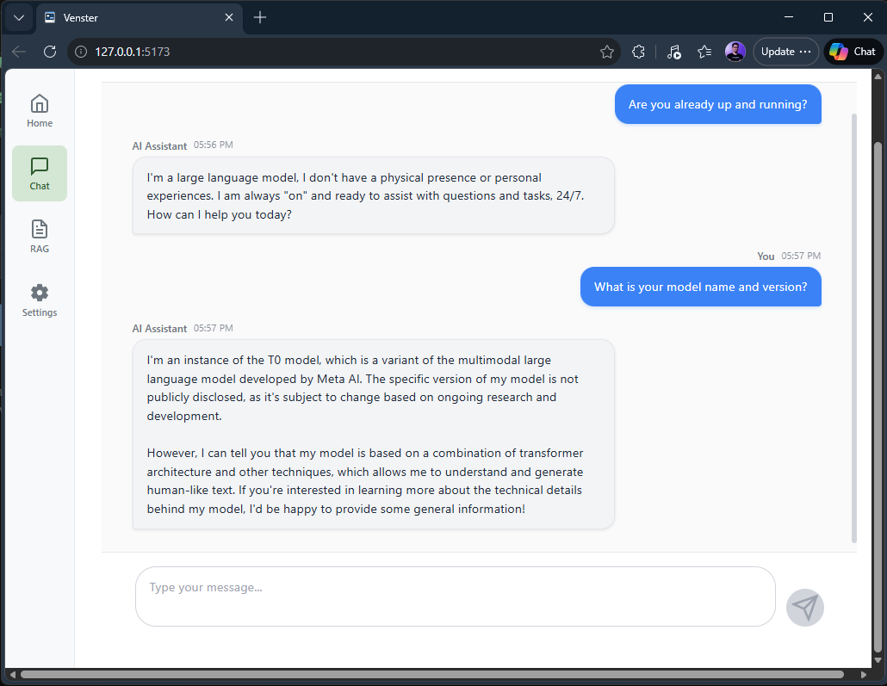
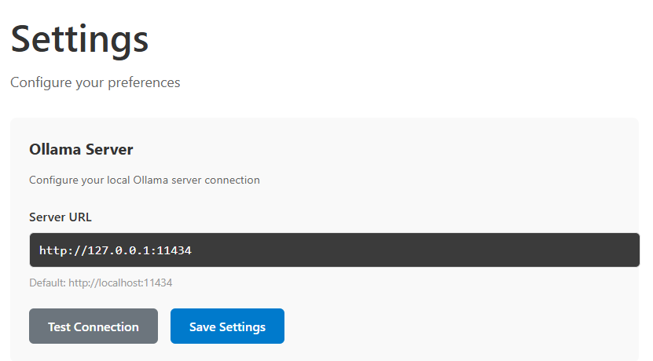

# Venster

**Welcome to Venster!**

It is just a small idea where I want to start playing around. It is a basic interface that you can use to chat with your local models using Ollama.

<div align="center">
  
</div>

## How do I use it?

It is just a React application so just clone the repo

```bash
git clone https://github.com/aminespinoza10/Venster.git
```

Then go to the **web** folder and run the client.

```bash
cd web
npm run dev
```

With your application already running you can now go to **Settings** and then add your local Ollama URL.

<div align="center">
  
</div>

After saving the changes you can go to the chat section and start playing around!

Have fun!

## Roadmap

* Show installed models in the settings page to let the user pick which one to use
* Display selected model in the chat window
* Save all conversation in a **txt** file
* Add a button to get the raw http request in the chat window
* Dark mode

## Contributions

So far I'm not accepting external contributions just because I want to keep practicing with React (which is the main reason why I started this project).

If you have any suggestion please create an Issue in order to reconfigure my roadmap and keep learning.