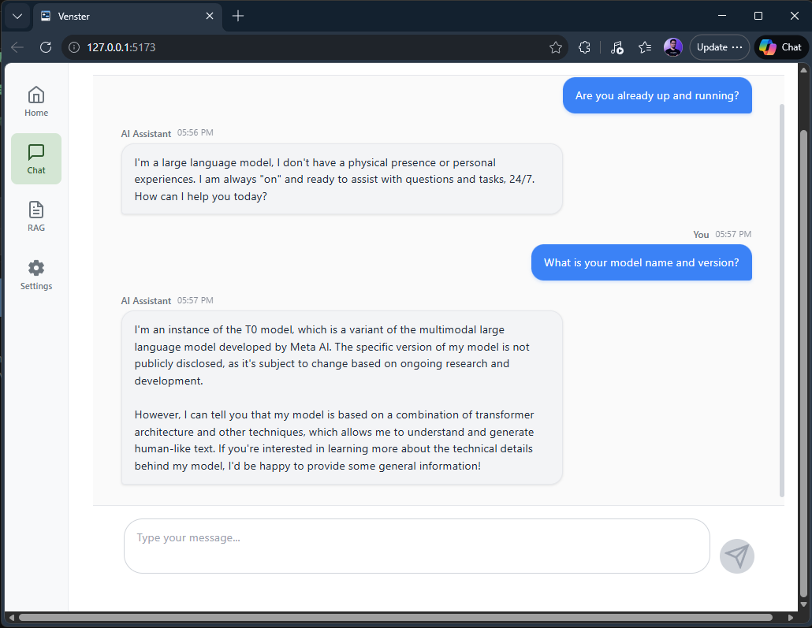
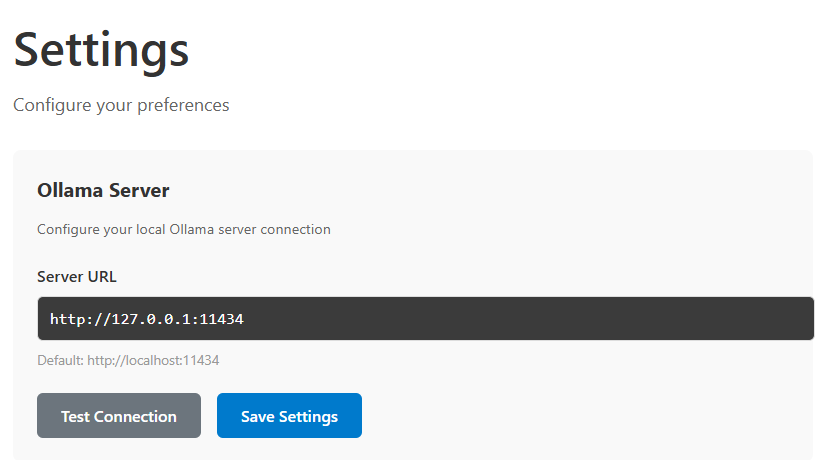

# Venster

**Welcome to Venster!**

It is just a small idea where I want to start playing around. It is a basic interface that you can use to chat with your local models using Ollama.

<div align="center">
  
</div>

## How do I use it?

### 🚀 Opción 1: Despliegue Rápido con Docker (Recomendado)

El método más sencillo para ejecutar toda la aplicación (API + Web) es usar Docker:

```bash
# Clonar el repositorio
git clone https://github.com/aminespinoza10/Venster.git
cd Venster

# Ejecutar el script de despliegue
./deploy.sh
```

El script te guiará a través de un menú interactivo donde podrás:
- ✅ Arrancar ambos servicios con un solo comando
- 📊 Ver logs en tiempo real
- 🔄 Reiniciar servicios
- 🛑 Detener todo cuando termines

**Accede a la aplicación:**
- Web: http://localhost
- API: http://localhost:8080
- Swagger: http://localhost:8080/swagger/

📖 Para más detalles sobre el despliegue, consulta [DEPLOYMENT.md](DEPLOYMENT.md)

### 🛠️ Opción 2: Desarrollo Manual

Si prefieres ejecutar los componentes manualmente para desarrollo:

**Backend (API en Go):**
```bash
cd api
go run main.go
```

**Frontend (React):**
```bash
cd web
npm install
npm run dev
```

With your application already running you can now go to **Settings** and then add your local Ollama URL.

<div align="center">
  
</div>

After saving the changes you can go to the chat section and start playing around!

Have fun!

## Roadmap

* ✅ ~~Docker deployment for easy setup~~ (Completado)
* Show installed models in the settings page to let the user pick which one to use
* Display selected model in the chat window
* Save all conversation in a **txt** file
* Add a button to get the raw http request in the chat window
* Dark mode

## Contributions

So far I'm not accepting external contributions just because I want to keep practicing with React (which is the main reason why I started this project).

If you have any suggestion please create an Issue in order to reconfigure my roadmap and keep learning.